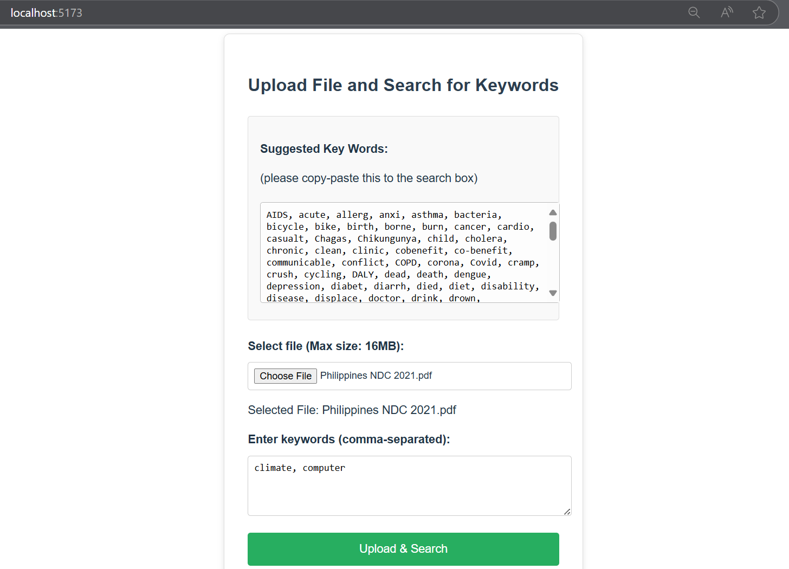

# 📄 PDF Text Extractor

A **React + Node.js** web application that allows users to **upload a PDF**, **search for keywords**, and **view extracted text** from specific pages.




---

## 🚀 Features

- 📁 **Upload PDF Files** (up to 16MB)
- 🔍 **Keyword Search** (comma-separated)
- 📄 **Page-by-Page Extraction**
- ✅ **Highlights Found Keywords**
- ❌ **Shows Keywords Not Found**
- 🌐 **Built with React, Express, and pdf.js**

---

## 📂 Project Structure
```
text-extractor-react/
├── backend/ # Express Backend
│ └── server.js
│ ├── src/ # React Frontend
│ ├── components/
│ │ ├── FileUploader.jsx # Handles file upload & search
│ │ └── SearchResults.jsx # Displays extracted results
│ ├── App.jsx
│ ├── App.css
│ └── main.jsx
│ ├── public/
│ └── index.html
│ ├── package.json
├── vite.config.js # Proxy for API calls
└── README.md
```

---

## 💾 Installation

1. **Clone the repository:**

   ```bash
   git clone https://github.com/your-username/text-extractor-react.git
   cd text-extractor-react
   ```

2. **Install dependencies for both frontend and backend:**

   ```bash
   # Install Frontend Dependencies
   npm install

   # Install Backend Dependencies
   cd backend
   npm install
   cd ..
   ```

---

## ⚙️ Configuration

1. **Create a .env file in the `/backend` folder:**

   ```env
   PORT=5000
   ```

2. **Set Up Proxy (Vite):**

   The `vite.config.js` is already configured to proxy API requests:

   ```javascript
   export default defineConfig({
     server: {
       proxy: {
         '/api': {
           target: 'http://localhost:5000',
           changeOrigin: true,
         },
       },
     },
   });
   ```

---

## ▶️ Running the App

1. **Start Backend (Express):**

   ```bash
   cd backend
   node server.js
   ```

2. **Start Frontend (React):**

   ```bash
   npm run dev
   ```

   - **Frontend:** [http://localhost:5173](http://localhost:5173)
   - **Backend:** [http://localhost:5000](http://localhost:5000)

---

## 🧾 How to Use

1. Go to [http://localhost:5173](http://localhost:5173).
2. Upload a PDF file (Max size: 16MB).
3. Enter comma-separated keywords (e.g., `climate, emissions, policy`).
4. Select Search Mode:
   - **Regular Search** → Exact match.
   - **Smart Search** → Contextualized keyword search.
5. **View Results:**
   - **✅ Keywords Found:** Shows pages & sentences.
   - **❌ Not Found:** Listed separately.
6. Go back and search again if needed.

---

## ⚡ Sample Keywords

```cpp
AIDS, asthma, cancer, climate, Covid, death, doctor, drought, emissions, flood, food, health, hospital, malaria, mosquito, nutrition, pandemic, rainfall, sanitation, smoke, temperature, vector, virus, water, welfare, Zika
```

---

## 🐛 Troubleshooting

- **CORS Error?**  
  Ensure the backend is running and the proxy in `vite.config.js` is set.

- **PDF Not Processing?**  
  Check backend logs for errors related to `pdfjs-dist`.

- **File Too Large?**  
  The max size is set to 16MB. Adjust in `server.js` if needed:

  ```javascript
  limits: { fileSize: 16 * 1024 * 1024 } // 16MB
  ```

---

## 🏆 Technologies Used

- **⚛️ React** – Frontend Framework  
- **📦 Express.js** – Backend API  
- **📄 pdf.js** – PDF Text Extraction  
- **🌐 Axios** – API Requests  
- **⚡ Vite** – Frontend Build Tool
```

